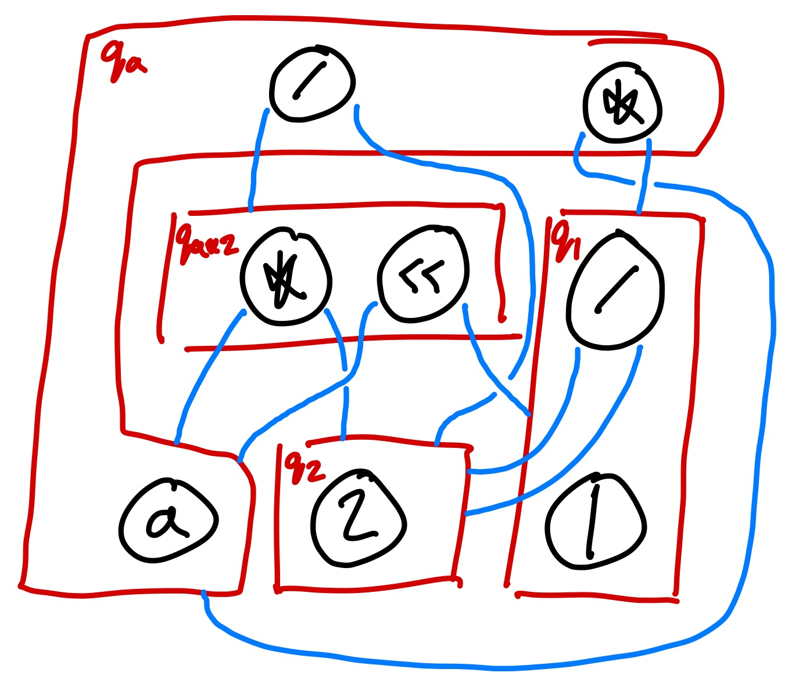

<!-- TODO: control image sizes using raw html -->
<!-- TODO: add citations for TATA (for lots of stuff) and Xinyu Wang for DFTA example -->
<!-- add bibtex blurb at the bottom -->

# E-Graphs Are Minimal DFTAs

<!-- TODO: edit to have a more positive clickbait. maybe also make title more clickbaity as well -->
In this post we'll explain how e-graphs, PL's golden egg, are DFTAs in disguise.

## E-Graphs

### What is an e-graph?

“An e-graph is a data structure to compactly store an equivalence relation (really a congruence relation) over terms.” - SIGPLAN post

An e-graph is constructed via a collection of rewrite rules. Each rewrite rule has a left-hand and right-hand side. If we match the LHS against the current e-graph, we learn that the LHS = RHS and add this equality (and the RHS term if it doesn’t exist) to the e-graph. We repeat until we want to stop or we hit saturation. Additionally, we may learn that two terms are congruent, which means that the function’s children are in the same equivalence classes and so the functions themselves must be equal.

### What is it used for?

An e-graph is a useful structure “for building compilers, optimizers, and synthesizers across many domains.” For example (e-graph from blog post):
- Szalinski shrinks 3D CAD programs to make them more editable. [PLDI 2020]
- Diospyros automatically vectorizes digital signal processing code. [ASPLOS 2021]
- Tensat optimizes deep learning compute graphs both better and faster (up to 50x) than the state of the art. [MLSys 2021]
- Herbie improves the accuracy of floating point expressions. The egg-herbie library made parts of Herbie over 3000x faster! [PLDI 2015]
SPORES optimizes linear algebra expressions up to 5x better than state-of-the-art. [VLDB 2020]

The egg paper won a distinguished paper award at POPL ‘21.

Example (from egg blog/paper):

To learn more check out [the egg website.](https://egraphs-good.github.io/)

**Note:** For the purposes of this blog post, the exact details of how rewrite rules work and are applied is not important. We only care about the properties of the final e-graph. The final e-graph has discovered all congruences between terms and sub-terms it represents. The final e-graph recognizes some language L, which is the set of all terms that can be extracted from the root.

## DFAs: A Refresher

Even if you've seen DFAs before, you might still want to read this section. We introduce DFAs in a
slightly different way that generalizes more readily to DFTAs.

A deterministic finite automaton (DFA) is a finite-state machine that takes in a word (i.e. string of
symbols pulled from a finite alphabet) and either accepts or rejects that word. It operates on one symbol at a
time. A DFA is deterministic, because
it progresses through exactly one state at a time.

Here's an example DFA that reads in a string of 0's and 1's and accepts the string iff all the
symbols are 1's (i.e. "and"-ing together all the symbols yields true).

States:
$Q = \{q_0, q_1\}$

Accepting State:
$Q_f = \{q_1\}$

Alphabet:
$F = \{0, 1\}$

Transition Rules:
$\Delta:$
  - $0 \to q_0$
  - $1 \to q_1$
  - $q_00 \to q_0$
  - $q_01 \to q_0$
  - $q_10 \to q_0$
  - $q_11 \to q_1$

Most descriptions of DFAs specify starting states. In our formalism there are no start states, just
special transition rules ($0 \to q_0$ and $1 \to q_1$) that don't take previous states.

It's probably easiest to understand how this DFA works by looking at an example execution:

The
machine first sees a 1 and doesn't have any existing state. So the $1 \to q_1$ transition rule fires. The
DFA is now in state $q_1$, which we show by replacing the first symbol with $q_1$. Next, the DFA is in state $q_1$ and sees symbol 1, so the rule $q_11 \to q_1$ fires, and the
DFA transitions back to state $q_1$. At the end of the input, the DFA is in state $q_0$, which is
not an accepting state so the input string is rejected.

We can draw a nice picture of the DFA like so:

Each transition rule corresponds to a labelled edge in the graph. The label is the input token. The
source (if there is one) is the current state of the DFA. The target is the state the DFA will
transition into.

This DFA graph is useful for evaluating input words, since you can traverse edges to advance the
state of the machine.

## DFTAs: Discrete Finite *Tree* Automata

DFTAs are like DFAs except instead of recognizing words, DFTAs recognize trees. The core pieces of
the definitions remain the same.

DFTAs are especially useful in PL, because we often work with ASTs, which are trees.

Formally a DFTA is a collection of the following:

A set of states $Q$.

A subset of states $Q_f \subseteq Q$ that accept.

An alphabet of function symbols $F = \{f(-, ..., -)\}$ where each $f$ has fixed (possibly 0)
arity.

A set of transition rules $\{f(q_1, \ldots, q_n) \to q\}$ where $q_1, \ldots, q_n, q \in Q$ and $f
\in F$. Since the DFTA is deterministic, the left-hand sides of the transition rules must be unique.

This generalizes the DFA definition. There are multiple ways to do so including having a special
nullary symbol `#` and writing e.g. `abc` as `c(b(a(#)))`. In the treatment we gave in the previous
section, we would introduce each symbol as both a nullary and unary function and then write e.g.
`abc` as `c(b(a))`.

Let’s see how a DFTA works
by generalizing our DFA example significantly. We define the language of boolean expressions
involving 0, 1, ~, and &. We can then define transition rules to determine whether the expression
evaluates to true or false. The transitions rules are essentially just the semantics of the expressions.

This example was taken from Xinyu Wang’s papers
and presentations.
<!-- todo: more precise citation -->

States:
$Q = \{q_0, q_1\}$

Accepting States:
$Q_f = \{q_1\}$

Alphabet:
$F = \{0, 1, \sim{}(-), \&(-, -)\}$

Transition Rules:
$\Delta:$
  - $0 \to q_0$
  - $1 \to q_1$
  - $\sim{}(q_0) \to q_1$
  - $\sim{}(q_1) \to q_0$
  - $\&(q_0, q_0) \to q_0$
  - $\&(q_0, q_1) \to q_0$
  - $\&(q_1, q_0) \to q_0$
  - $\&(q_1, q_1) \to q_1$

Unlike a DFA where we need to track just one state at a time. We begin our DFTA execution by
tracking a state at every leaf. We first transition $1$ to $q_1$ and $0$ to $q_0$ using the
transition rules $0 \to q_0$ and $1 \to q_1$, respectively. Next we transition $\sim{}(q_0)$ to
$q_1$. So far other than having multiple simultaneous starting points, this is very similar to
executing a DFA. The next step is more interesting. We encounter the binary operation &. To figure
out what state to transition to, we need to examine the states of its arguments. Since both of its
arguments are in state $q_1$, we apply the rule $\&(q_1, q_1) \to q_1$ to advance to state $q_1$.

As with a DFA, we can make a compact representation of a DFTA. However, instead of having at most
one source, we now have one source per function argument! We still have just one target per transition.

We first add 0, 1, and the two ~ transitions. Note that this is actually a DFA! Nothing fancy going
on yet.

After this we add the four transitions for &. Each of them has two inputs/sources and one output/target.

Formally, each transition rule is a labelled hyperedge (which is just another way of saying an edge
with multiple sources and targets).

Since these diagrams grow very large very quickly, we can take advantage of the fact that each
transition rule has exactly one target to make a more compact representation. We make a box for each
state of the DFTA. Then we push each label pointing to that state into the box.

Much simpler!

## Myhill-Nerode Theorem (and Congruence Closure)
There is an important theorem associated with DFTAs that is a generalization of a corresponding theorem for DFAs. This theorem gives us a way to describe a canonical minimal DFTA for any recognizable language (that is, for any language we can recognize with *some*, not necessarily minimal, DFTA). This is nice, because it allows us to optimize our DFTAs and also quickly identify whether or not two DFTAs are equivalent.

*Theorem*. Every DFTA $A = (Q, Q_f, F, \Delta)$ recognizing a language $L$ has a unique (and complete) *minimal* DFTA $A_{min}$ which recognizes $L$ (i.e. has the minimal number of states), up to relabeling. [see TATA for a precise statement and proof]

*Proof sketch*. This theorem is a direct corollary of the **Myhill-Nerode theorem for DFTAs** (which itself is a generalization of the Myhill-Nerode theorem for DFAs). Here’s a proof sketch for Myhill-Nerode.

DFTA states are "forgetful." If two terms end up in the same state, the DFTA cannot distinguish between them since it remembers only their final state and not where they came from. We can run this implication in reverse and describe precisely which terms our DFTA doesn’t need to distinguish between while still recognizing $L$. The minimal DFTA is maximally forgetful. If two terms $u$ and $v$ can be substituted for each other in any context without affecting inclusion or exclusion in $L$, then the minimal DFTA doesn’t need to distinguish between them. In particular, we can define the congruence $\equiv_L$ on $T(F)$ by

$$u \equiv_L v := \forall f \in F.~f(\dots, u, \dots) \in L \iff f(\dots, v, \dots) \in L.$$
<!-- u =L v if ∀C ∈ C. C[u] ∈ L iff C[v] ∈ L -->

Note the surrounding ellipses denoted by "$\dots$" must be equal on either side of the iff and may be arbitrary terms in $T(F)$.

Essentially, $u \equiv_L v$  when $u$ and $v$ can be "substituted" for each other in any context without affecting inclusion in $L$. Now, $A_{min}$ can be defined as follows:
- Our new states $Q_{min}$ are the equivalence classes of $\equiv_L$.
- Our accepting states $Q_{min\,f}$ are the equivalence classes of all terms in $L \subseteq T(F)$.
- Our transitions are 
  $$f([u_1], \dots, [u_n]) \to [f(u_1, \dots, u_n)]~\text{for each}~f \in F.$$
  Note that nullary symbols just get sent to their equivalence class.

We refer the reader to TATA for a minimization procedure that computes $A_{min}$ using $A$.
<!-- upward merging is also a way -->

**Note.** We say a DFTA is complete when there is precisely one transition for each $f \in F$ and
input  It is possible to obtain an (incomplete) DFTA which recognizes $L$ that is one state**states $q_i$.
smaller than the one described here. In particular, consider the set of terms

$$\pi = \{u \mid \forall f \in F.~f(\dots, u, \dots) \not\in L\} \subseteq T(F).$$

If $\pi \neq \emptyset$, then $\pi \in Q_{min}$ as it trivially defines an equivalence class of $\equiv_L$.
Additionally, for any $f$ and $q$ such that $f(..., \pi, ...) \to q,$ we have that $q$ satisfies the
same property as $\pi$ (as otherwise $\pi$ would have an accepting context). Hence it follows that
$q = \pi$ definitionally, and all $f$ involving $\pi$ transition to $\pi$. Effectively, $\pi$ is a
"garbage state" (and is explicitly constructed when completing incomplete DFTAs). Since we don't
need completeness, we can safely delete this state and all associated transitions, and
the resulting incomplete DFTA will just "get stuck" without a transition whenever a term would have
previously looped on the garbage state.

### Minimal DFTAs → E-graphs

Now, it's basically by definition that $Q_{min}$ are your e-classes, and each transition $f([u_1],
\dots, [u_n]) \to [f(u_1, \dots, u_n)]$ is an e-node with symbol $f$ belonging in e-class $[f(u_1,
\dots, u_n)]$ with child e-classes $[u_1], \dots, [u_n]$. Congruence of the e-graph follows from the
the saAs expected, c$\equiv_L$ being a congruence relation and the construction of the transitions.

The language $L$ can be recovered from the e-graph as the set of all terms that can be extracted
from the corresponding accepting e-classes.

## E-graphs → Minimal DFTAs
Now that we know how minimal DFTAs directly map to e-graphs, we can just run the conversion backwards
to get DFTAs from e-graphs. 

Consider the example from before:

The corresponding DFTA is then given by:

$Q = \{q_a, q_1, q_2, q_{a*2}\}$

$Q_f = \{q_a\}$

$F = \{a, 1, 2, *(-, -), <<(-, -), /(-, -)\}$

$\Delta:$
  - $a \to q_a$
  - $*(q_a, q_1) \to q_a$
  - $/(q_{a*2}, q_2) \to q_a$
  - $1 \to q_1$
  - $/(q_2, q_2) \to q_1$
  - $2 \to q_2$
  - $*(q_a, q_2) \to q_{a*2}$
  - $<<(q_a, q_1) \to q_{a*2}$

While e-graphs don't inherently have a notion of "accepting", we often care mainly about the "root"
e-class representing an initial term to be rewritten, so in this conversion we treat it as the
corresponding accepting state.

## Future Work
Tree grammars and tree automata have already been used in several papers in PL. For example, tree grammars have been used to write better parsers [cite]. Intersecting tree automata has been used for PBE synthesis [cite]. There are also variations on DFTAs that could prove useful as well as transformations called inverse tree homomorphisms. The recognition of the equivalence between E-Graphs and DFTAs allows us to ask new questions about how to apply techniques from both bodies of literature.

Recent PL literature using tree automata
- Tree automata and parsing: https://michaeldadams.org/papers/restricting-grammars-with-tree-automata/
- Tree automata and synthesis: https://web.eecs.umich.edu/~xwangsd/pubs/oopsla17.pdf
- Tree automata and synthesis: https://web.eecs.umich.edu/~xwangsd/pubs/popl18.pdf

Previous work identifying the relationship between DFTAs and e-graphs (thanks to Remy Wang for finding these!). In contrast, our work gives a more precise correspondence using minimal DFTAs and updates the terminology.
- Paper that, among other things, briefly discusses the connection between DFTAs and e-graphs (referred to as EDAGs in the paper) (NOTE: e-graphs don’t need to be DAGs!): https://people.eecs.berkeley.edu/~necula/Papers/join_fsttcs04.pdf
- Another paper relating DFTAs to e-graphs (referred to as D-rules in the paper): https://link.springer.com/content/pdf/10.1023/B:JARS.0000009518.26415.49.pdf

## References
- https://gitlab.com/remywang/blog/-/blob/master/posts/egraph-inter.md
- Abstract congruence closure
- Gulwani post
- Xinyu Wang's work

## Appendix
TODO: maybe the congruence relation proof here
