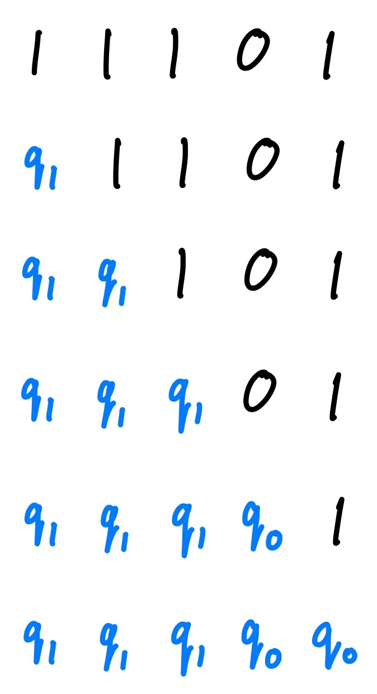

<!-- add bibtex blurb at the bottom -->

# E-Graphs Are Minimal Deterministic Finite Tree Automata (DFTAs)

<!-- TODO: edit to have a more positive clickbait. maybe also make title more clickbaity as well -->
In this post we'll explain how e-graphs, PL's golden egg, are deterministic finite tree automata (DFTAs) in disguise.

## E-Graphs

This section provides a quick background on e-graphs. Feel free to skip this section if you already
know what they are!

For a more detailed introduction to e-graphs and the egg library, check out the [egg website](https://egraphs-good.github.io/).

### What is an e-graph?

“An e-graph is a data structure to compactly store an equivalence relation (really a congruence relation) over terms.” - [Fast and Extensible Equality Saturation with egg](https://blog.sigplan.org/2021/04/06/equality-saturation-with-egg/)

A term is a tree of function symbols. An e-graph is often constructed via a collection of rewrite
rules. Each rewrite rule has a left-hand and right-hand side. If we match the LHS against the
current e-graph, we learn that the LHS = RHS and add this equality (and the RHS term if it doesn’t
exist) to the e-graph. We repeat until we want to stop or we hit saturation. Additionally, we may
learn that two terms with equivalent root symbols are congruent, which means that their children are in the same
equivalence classes and so the functions themselves must be equivalent.

### What is it used for?

Quoting again from [Fast and Extensible Equality Saturation with egg](https://blog.sigplan.org/2021/04/06/equality-saturation-with-egg/):

An e-graph is a useful structure “for building compilers, optimizers, and synthesizers across many
domains.” For example:
> - [Szalinski](https://github.com/uwplse/szalinski) shrinks 3D CAD programs to make them more editable. [PLDI 2020]
> - [Diospyros](https://asplos-conference.org/abstracts/asplos21-paper142-extended_abstract.pdf) automatically vectorizes digital signal processing code. [ASPLOS 2021]
> - [Tensat](https://arxiv.org/abs/2101.01332) optimizes deep learning compute graphs both better and faster (up to 50x) than the state of the art. [MLSys 2021]
> - [Herbie](http://herbie.uwplse.org/) improves the accuracy of floating point expressions. The [egg-herbie](https://github.com/herbie-fp/egg-herbie) library made parts of Herbie over 3000x faster! [PLDI 2015]
> - [SPORES](https://arxiv.org/abs/2002.07951) optimizes linear algebra expressions up to 5x better than state-of-the-art. [VLDB 2020]

The [egg paper](https://dl.acm.org/doi/10.1145/3434304) won a distinguished paper award at POPL 2021.

Here is an example e-graph that is built up by several rewrites:

**Note:** For the purposes of this blog post, the exact details of how rewrite rules work and are
applied is not important. We only care about the properties of the final e-graph. The final e-graph
has discovered all congruences between terms and sub-terms it represents.
<!-- The final e-graph recognizes some language L, which is the set of all terms that can be extracted from the root. -->

## Deterministic Finite Automata (DFAs): A Refresher

Even if you've seen DFAs before, you might still want to read this section. We introduce DFAs in a
slightly different way that generalizes more readily to DFTAs.

A deterministic finite automaton (DFA) is a finite-state machine that takes in a word (i.e. a string of
symbols pulled from a finite alphabet) and either accepts or rejects that word. It operates on one symbol at a
time. A DFA is deterministic, because
it progresses through exactly one state at a time.

Here's an example DFA that reads in a string of 0's and 1's and accepts the string iff all the
symbols are 1's (i.e. "and"-ing together all the symbols yields true):

- States: `Q = {q₀, q₁}`
<!-- $Q = \{q_0, q_1\}$ -->

- Accepting State: `Qf = {q₁}`
<!-- $Q_f = \{q_1\}$ -->

- Alphabet: `F = {0, 1}`
<!-- $F = \{0, 1\}$ -->

- Transition Rules `Δ`:
  - `0 -> q₀`
  - `1 -> q₁`
  - `q₀0 -> q₀`
  - `q₀1 -> q₀`
  - `q₁0 -> q₀`
  - `q₁1 -> q₁`

<!--   - $0 \to q_0$
  - $1 \to q_1$
  - $q_00 \to q_0$
  - $q_01 \to q_0$
  - $q_10 \to q_0$
  - $q_11 \to q_1$ -->

Most descriptions of DFAs specify starting states. In our formalism there are no start states, just
special transition rules (`0 -> q₀` and `1 -> q₁`) that don't take previous states.

It's probably easiest to understand how this DFA works by looking at an example execution:

The
machine first sees a 1 and doesn't have any existing state, so the `1 -> q₁` transition rule fires. The
DFA is now in state `q₁`, which we show by replacing the first symbol with `q₁`. Next, the DFA is in state `q₁` and sees symbol 1, so the rule `q₁1 -> q₁` fires, and the
DFA transitions to state `q₁` again. This process continues until the DFA has consumed the entire
input word. At the end, the DFA is in state `q₀`, which is
not an accepting state so the input string is rejected.

We can draw a nice picture of the DFA like so:

Each transition rule corresponds to a labelled edge in the graph. The label is the input token. The
source (if there is one) is the current state of the DFA. The target is the state the DFA will
transition into.

Representing a DFA as a graph is useful for evaluating input words by hand, since you can simulate the execution of a DFA
by traversing the edges of the graph.

## DFTAs: Deterministic Finite *Tree* Automata

DFTAs are like DFAs except instead of recognizing words, DFTAs recognize trees. The core pieces of
the definitions remain the same. DFTAs are especially useful in PL, because we often work with ASTs, which are trees.

*In the rest of this post we borrow heavily from [Tree Automata Techniques and Applications
(TATA)](http://tata.gforge.inria.fr/) for definitions and theorems about DFTAs.*

Formally a DFTA is a collection of the following:

- A set of states `Q`.

- A subset of states `Qf ⊆ Q` that accept.

- An alphabet of function symbols `F = {f(-, ..., -)}` where each `f` has fixed (possibly 0)
  arity.

- A set of transition rules `{f(q₁, ..., qₙ) -> q}` where `q₁, ..., qₙ, q ∈ Q` and
  `f ∈ F`. Since the DFTA is deterministic, the left-hand sides of the transition rules must be unique.

This generalizes the DFA definition. There are multiple ways to simulate a DFA using a DFTA including having a special
nullary symbol `#` and writing e.g. `abc` as `c(b(a(#)))`. In the treatment we gave in the previous
section, we would introduce each symbol as both a nullary and unary function and then write e.g.
`abc` as `c(b(a))`.

Let’s see how a DFTA works
by generalizing our DFA example significantly. We define the language of boolean expressions
involving `0`, `1`, `~`, and `&`. We can then define transition rules to determine whether the expression
evaluates to true or false. The transitions rules are essentially just the semantics of the
expressions. We borrowed this example from Xinyu Wang’s [DFTA
work](https://web.eecs.umich.edu/~xwangsd/pubs/oopsla17.pdf).
<!-- todo: more precise citation -->

- States: `Q = {q₀, q₁}`

- Accepting States: `Qf = {q₁}`

- Alphabet: `F = {0, 1, ∼(−), &(−, −)}`

- Transition Rules `Δ`:
  - `0 -> q₀`
  - `1 -> q₁`
  - `~(q₀) -> q₁`
  - `~(q₁) -> q₀`
  - `&(q₀, q₀) -> q₀`
  - `&(q₀, q₁) -> q₀`
  - `&(q₁, q₀) -> q₀`
  - `&(q₁, q₁) -> q₁`

  <!-- - $0 \to q_0$
  - $1 \to q_1$
  - $\sim{}(q_0) \to q_1$
  - $\sim{}(q_1) \to q_0$
  - $\&(q_0, q_0) \to q_0$
  - $\&(q_0, q_1) \to q_0$
  - $\&(q_1, q_0) \to q_0$
  - $\&(q_1, q_1) \to q_1$ -->

Here's an example execution of the DFTA on the input tree `~(1 & ~0)`, which we can write
without syntactic sugar as `~(&(1, ~(0)))`.

Unlike a DFA where we need to track just one state at a time. We begin our DFTA execution by
keeping track of a state at every leaf. We first transition `1` to `q₁` and `0` to `q₀` using the
transition rules `0 -> q₀` and `1 -> q₁`, respectively. Next we transition `~(q₀)` to
`q₁`. So far other than having multiple simultaneous starting points, this is very similar to
executing a DFA. The next step is more interesting. We encounter the binary operation `&`. To figure
out what state to transition to, we need to examine the states of its arguments. Since both of its
arguments are in state `q₁`, we apply the rule `&(q₁, q₁) -> q₁` to advance to state `q₁`.
Finally the DFTA advances to state `q₀`, which is not an accepting state, and so the input is
rejected (i.e. it does not evaluate to true).

As with a DFA, we can make a compact representation of a DFTA. However, instead of having at most
one source, we now have one source per function argument! We still have just one target per
transition.

We use the same legend as before:

We first add `0`, `1`, and the two `~` transitions. (Notice this is actually a DFA! It recognizes words
starting with `0` or `1` followed by zero or more `~`s.) Nothing fancy going
on yet.

After this we add the four transitions for `&`. Each of them has two inputs/sources and one output/target.

Formally, each transition rule is a labelled hyperedge (which is just another way of saying an edge
with multiple sources and targets).

Since these diagrams grow very large very quickly, we can take advantage of the fact that each
transition rule has exactly one target to make a more compact representation. We make a box for each
state of the DFTA. Then we push each label pointing to that state into the box.

Much simpler!

## Myhill-Nerode Theorem (and Congruence Closure)

The astute reader may have noticed the visualization above looks a lot like an e-graph! We're almost
there, but our DFTA formalism is still missing one crucial feature: congruence. In this section
we'll see how congruence "pops out" of the Myhill-Nerode theorem for DFTAs.

There is an important theorem associated with DFTAs that is a generalization of a corresponding theorem for DFAs. This theorem gives us a way to describe a canonical minimal DFTA for any recognizable language (that is, for any language we can recognize with *some*, not necessarily minimal, DFTA). This is nice, because it allows us to optimize our DFTAs and also quickly identify whether or not two DFTAs are equivalent.

*Theorem*. Every DFTA `A = (Q, Qf, F, Δ)` recognizing a language `L` has a unique (and complete*) *minimal* DFTA `A_min` which recognizes `L` (i.e. has the minimal number of states), up to relabeling. (See [TATA](http://tata.gforge.inria.fr/) for a precise statement and proof.)

*Proof sketch*. This theorem is a direct corollary of the **Myhill-Nerode theorem for DFTAs** (which itself is a generalization of the Myhill-Nerode theorem for DFAs). Here’s a proof sketch for Myhill-Nerode.

DFTA states are "forgetful." If two terms end up in the same state, the DFTA cannot distinguish
between them since it remembers only their final state and not where they came from. We can run this
implication in reverse and describe precisely which terms our DFTA doesn’t need to distinguish
between while still recognizing `L`. The minimal DFTA is maximally forgetful. If two terms `u` and
`v` can be substituted for each other in any context without affecting inclusion or exclusion in
`L`, then the minimal DFTA doesn’t need to distinguish between them. In particular we can define
the congruence `≡L` on `T(F)`, the set of terms using symbols in `F`,  by

<!-- $$u \equiv_L v := \forall f \in F.~f(\dots, u, \dots) \in L \iff f(\dots, v, \dots) \in L.$$ -->
`u ≡L v := ∀f ∈ F. f(..., u, ...) ∈ L ⟺ f(..., v, ...) ∈ L`
<!-- u =L v if ∀C ∈ C. C[u] ∈ L iff C[v] ∈ L -->

Note the surrounding ellipses denoted by `...` must be equal on either side of the iff and may be arbitrary terms in `T(F)`.

Essentially, `u ≡L v`  when `u` and `v` can be "substituted" for each other in any context without
affecting inclusion in `L`. Now, `A_min` can be defined as follows:
- Our new states `Q_min` are the equivalence classes of `≡L`.
- Our accepting states `Qf_min` are the equivalence classes of all terms in `L ⊆ T(F)`.
- Our transitions are 
  `f([u₁], ..., [uₙ]) -> [f(u₁, ..., uₙ)]` for each `f ∈ F` where `[u]` is the equivalence class of `u`.
  <!-- Note that nullary symbols just get sent to their equivalence class. -->

We refer the reader to TATA for a minimization procedure that computes `A_min` using `A`.
<!-- upward merging is also a way -->

*We say a DFTA is complete when there is precisely one transition for each `f ∈ F` and
input states `qᵢ`. It is possible to obtain an (incomplete) DFTA which recognizes `L` that is one state
smaller than the one described here. In particular, consider the set of terms

<!-- $$\pi = \{u \mid \forall f \in F.~f(\dots, u, \dots) \not\in L\} \subseteq T(F).$$ -->
`π = {u ∣ ∀f ∈ F. f(..., u, ...) ∉ L} ⊆ T(F)`

If `π ≠ ∅`, then `π ∈ Q_min` as it defines an equivalence class of `≡L`.
Additionally, for any `f` and `q` such that `f(..., π, ...) -> q`, we have that `q` satisfies the
same property as `π` (as otherwise `π` would have an accepting context). Hence it follows that
`q = π`, and all transition rules with `π` on the left-hand side transition to `π`. Effectively, `π` is a
"garbage state" (and is explicitly constructed when completing incomplete DFTAs). Once some sub-term enters
state `π`, all future transitions return back to `π`. If we don't care about completeness, we can safely delete this state and all associated transitions.
The resulting incomplete DFTA will just "get stuck" without a transition whenever a term would have
previously looped on the garbage state.

Note: Garbage states often have many transitions, so they usually aren't worth keeping around.

## Minimal DFTAs ↔ E-graphs

Notice `Q_min` are e-classes, and each transition `f([u_1],
..., [u_n]) -> [f(u_1, ..., u_n)]` is an e-node with symbol `f` belonging in e-class `[f(u_1, ...,
u_n)]` with child e-classes `[u_1], ..., [u_n]`. Thus minimal DFTAs and e-graphs are really the same
thing!

Note: An e-graph induces a tree language `L` of the set of all terms that can be extracted from some
distinguished set of e-classes. In practice this is the typically the root e-class.

To be more concrete, consider the example from before:

We can redraw this in the box notation we gave earlier.

The corresponding DFTA is then given by:

- `Q = {q_a, q_1, q_2, q_{a*2}}`

- `Qf = {q_a}`

- `F = {a, 1, 2, *(-, -), <<(-, -), /(-, -)}`

- `Δ`:
  - `a -> q_a`
  - `*(q_a, q_1) -> q_a`
  - `/(q_{a*2}, q_2) -> q_a`
  - `1 -> q_1`
  - `/(q_2, q_2) -> q_1`
  - `2 -> q_2`
  - `*(q_a, q_2) -> q_{a*2}`
  - `<<(q_a, q_1) -> q_{a*2}`

Et voilà!

## Discussion

We are aware of a couple papers that have considered the relationship between DFTAs and e-graphs. (Thanks to [Remy
Wang](https://remy.wang/) for finding these!) [Gulwani et
al.](https://people.eecs.berkeley.edu/~necula/Papers/join_fsttcs04.pdf) relate tree automata to
*EDAGs*, which is another word for e-graphs. [Bachmair et
al.](https://link.springer.com/content/pdf/10.1023/B:JARS.0000009518.26415.49.pdf) relate tree
automata to *D-rules*. In contrast, our work
uses minimal DFTAs
and the Myhill-Nerode
theorem to give a more precise correspondence between tree automata and e-graphs. Our post is also
the first to discuss this correspondence using e-graph terminology.
<!-- - Paper that, among other things, briefly discusses the connection between DFTAs and e-graphs (referred to as EDAGs in the paper) (NOTE: e-graphs don’t need to be DAGs!): https://people.eecs.berkeley.edu/~necula/Papers/join_fsttcs04.pdf -->
<!-- - Another paper relating DFTAs to e-graphs (referred to as D-rules in the paper): https://link.springer.com/content/pdf/10.1023/B:JARS.0000009518.26415.49.pdf -->

Independently from the e-graph literature, PL researchers have recently found uses for tree automata. For example, tree
grammars have been used to [write better
parsers](https://michaeldadams.org/papers/restricting-grammars-with-tree-automata/).
Tree automata intersection has been used for [PBE
synthesis](https://web.eecs.umich.edu/~xwangsd/pubs/oopsla17.pdf) combined with
[abstraction-refinement](https://web.eecs.umich.edu/~xwangsd/pubs/popl18.pdf). In fact we first
realized the connection between tree automata and e-graphs by trying to translate these synthesis
papers to e-graphs! You can read more about e-graph intersection [here](https://gitlab.com/remywang/blog/-/blob/master/posts/egraph-inter.md).

<!-- There are also
variations on
DFTAs that could prove useful as well as transformations called inverse tree homomorphisms. -->

The correspondence between e-graphs and DFTAs prompts us to ask questions about how
to apply techniques from both bodies of literature. For example, could the synthesis and parsing
techniques above be further enhanced using equality saturation? How might inverse tree homomorphisms be used in
e-graphs?

Additionally, egg provides a convenient API for experimenting with and implementing tree automata
techniques, even when equivalence classes aren't required.

We hope this post gives you another perspective on e-graphs and some promising new directions to explore!

## Acknowledgements

Thanks to [Max Willsey](https://www.mwillsey.com/) for reviewing this post! Thanks to [Jimmy
Koppel](http://www.jameskoppel.com/) for encouraging us to write it.
