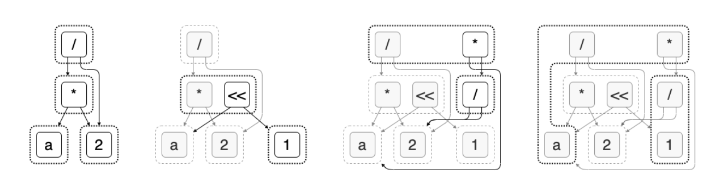

<!-- TODO: control image sizes using raw html -->

# E-Graphs Are Minimal DFTAs

<!-- TODO: edit to have a more positive clickbait. maybe also make title more clickbaity as well -->
In this post we'll explain how e-graphs, PL's golden child, are DFTAs in disguise.

## E-Graphs

### What is an e-graph?

“An e-graph is a data structure to compactly store an equivalence relation (really a congruence relation) over terms.” - SIGPLAN post

An e-graph is constructed via a collection of rewrite rules. Each rewrite rule has a left-hand and right-hand side. If we match the LHS against the current e-graph, we learn that the LHS = RHS and add this equality (and the RHS term if it doesn’t exist) to the e-graph. We repeat until we want to stop or we hit saturation. Additionally, we may learn that two terms are congruent, which means that the function’s children are in the same equivalence classes and so the functions themselves must be equal.

### What is it used for?

An e-graph is a useful structure “for building compilers, optimizers, and synthesizers across many domains.” For example (e-graph from blog post):
- Szalinski shrinks 3D CAD programs to make them more editable. [PLDI 2020]
- Diospyros automatically vectorizes digital signal processing code. [ASPLOS 2021]
- Tensat optimizes deep learning compute graphs both better and faster (up to 50x) than the state of the art. [MLSys 2021]
- Herbie improves the accuracy of floating point expressions. The egg-herbie library made parts of Herbie over 3000x faster! [PLDI 2015]
SPORES optimizes linear algebra expressions up to 5x better than state-of-the-art. [VLDB 2020]

The egg paper won a distinguished paper award at POPL ‘21.

Example (from egg blog/paper):

To learn more check out [the egg website.](https://egraphs-good.github.io/)

## DFAs: A Refresher

Even if you've seen DFAs before, you might still want to read this section. We introduce DFAs in a
slightly different way that generalizes more readily to DFTAs.

## DFTAs: Discrete Finite *Tree* Automata

## Myhill-Nerode Theorem (and Congruence Closure)
There is an important theorem associated with DFTAs that is a generalization of a corresponding theorem for DFAs. This theorem gives us a way to describe a canonical minimal DFTA for any recognizable language (that is, for any language we can recognize with *some*, not necessarily minimal, DFTA). This is nice, because it allows us to optimize our DFTAs and also quickly identify whether or not two DFTAs are equivalent.

*Theorem*. Every DFTA $A = (Q, Q_f, F, \Delta)$ recognizing a language $L$ has a unique *minimal* DFTA $A_{min}$ which recognizes $L$ (i.e. has the minimal number of states), up to relabeling. [see TATA for a precise statement and proof]

*Proof sketch*. This theorem is a direct corollary of the **Myhill-Nerode theorem for DFTAs** (which itself is a generalization of the Myhill-Nerode theorem for DFAs). Here’s a proof sketch for Myhill-Nerode.

DFTA states are "forgetful." If two terms end up in the same state, the DFTA cannot distinguish between them since it remembers only their final state and not where they came from. We can run this implication in reverse and describe precisely which terms our DFTA doesn’t need to distinguish between while still recognizing $L$. The minimal DFTA is maximally forgetful. If two terms $u$ and $v$ can be substituted for each other in any context without affecting inclusion or exclusion in $L$, then the minimal DFTA doesn’t need to distinguish between them. In particular, we can define the congruence $\equiv_L$ on $T(F)$ by

$$u \equiv_L v := \forall f \in F.~f(\dots, u, \dots) \in L \iff f(\dots, v, \dots) \in L.$$
<!-- u =L v if ∀C ∈ C. C[u] ∈ L iff C[v] ∈ L -->

Note the surrounding ellipses denoted by "$\dots$" must be equal on either side of the iff and may be arbitrary terms in $T(F)$.

Essentially, $u \equiv_L v$  when $u$ and $v$ can be "substituted" for each other in any context without affecting inclusion in $L$. Now, $A_{min}$ can be defined as follows:
- Our new states $Q_{min}$ are the equivalence classes of $\equiv_L$.
- Our accepting states $Q_{min\,f}$ are the equivalence classes of all terms in $L \subseteq T(F)$.
- Our transitions are 
  $$f([u_1], \dots, [u_n]) \to [f(u_1, \dots, u_n)]~\text{for each}~f \in F.$$
  Note that nullary symbols just get sent to their equivalence class.

We refer the reader to TATA for a minimization procedure that computes $A_{min}$ using $A$.
<!-- upward merging is also a way -->

### Bruh Moment

$Q_{min}$ are your e-classes, and each transition $f([u_1], \dots, [u_n]) \to [f(u_1, \dots, u_n)]$ is an e-node with symbol $f$ belonging in e-class $[f(u_1, \dots, u_n)]$ with child e-classes $[u_1], \dots, [u_n]$.

The case with multiple accepting states is slightly subtle: you recover $L$ from the e-graph by
extracting from (any of) the e-classes that correspond to the accepting states.

## E-graphs → DFTAs
Now that we know how minimal DFTAs directly map to e-graphs, we can just run the relation backwards
to get DFTAs from e-graphs.

- $Q = \{q_a, q_1, q_2, q_{a*2}\}$
- $Q_f = \{q_a\}$
- $F = \{a, 1, 2, *(-, -), <<(-, -), /(-, -)\}$
- $\Delta:$
    - $a \to q_a$
    - $*(q_a, q_1) \to q_a$
    - $/(q_{a*2}, q_2) \to q_a$
    - $1 \to q_1$
    - $/(q_2, q_2) \to q_1$
    - $2 \to q_2$
    - $*(q_a, q_2) \to q_{a*2}$
    - $<<(q_a, q_1) \to q_{a*2}$

## Future Work
Tree grammars and tree automata have already been used in several papers in PL. For example, tree grammars have been used to write better parsers [cite]. Intersecting tree automata has been used for PBE synthesis [cite]. There are also variations on DFTAs that could prove useful as well as transformations called inverse tree homomorphisms. The recognition of the equivalence between E-Graphs and DFTAs allows us to ask new questions about how to apply techniques from both bodies of literature.

Recent PL literature using tree automata
- Tree automata and parsing: https://michaeldadams.org/papers/restricting-grammars-with-tree-automata/
- Tree automata and synthesis: https://web.eecs.umich.edu/~xwangsd/pubs/oopsla17.pdf
- Tree automata and synthesis: https://web.eecs.umich.edu/~xwangsd/pubs/popl18.pdf

Previous work identifying the relationship between DFTAs and e-graphs (thanks to Remy Wang for finding these!). In contrast, our work gives a more precise correspondence using minimal DFTAs and updates the terminology.
- Paper that, among other things, briefly discusses the connection between DFTAs and e-graphs (referred to as EDAGs in the paper) (NOTE: e-graphs don’t need to be DAGs!): https://people.eecs.berkeley.edu/~necula/Papers/join_fsttcs04.pdf
- Another paper relating DFTAs to e-graphs (referred to as D-rules in the paper): https://link.springer.com/content/pdf/10.1023/B:JARS.0000009518.26415.49.pdf

Refs
- https://gitlab.com/remywang/blog/-/blob/master/posts/egraph-inter.md
- Abstract congruence closure
- Gulwani post
- Xinyu Wang stuff

## Appendix
TODO: maybe the congrunce relation proof here
